# Experience PULA CROATIA

### Welcome to EXPERIENCE PULA CROATIA!

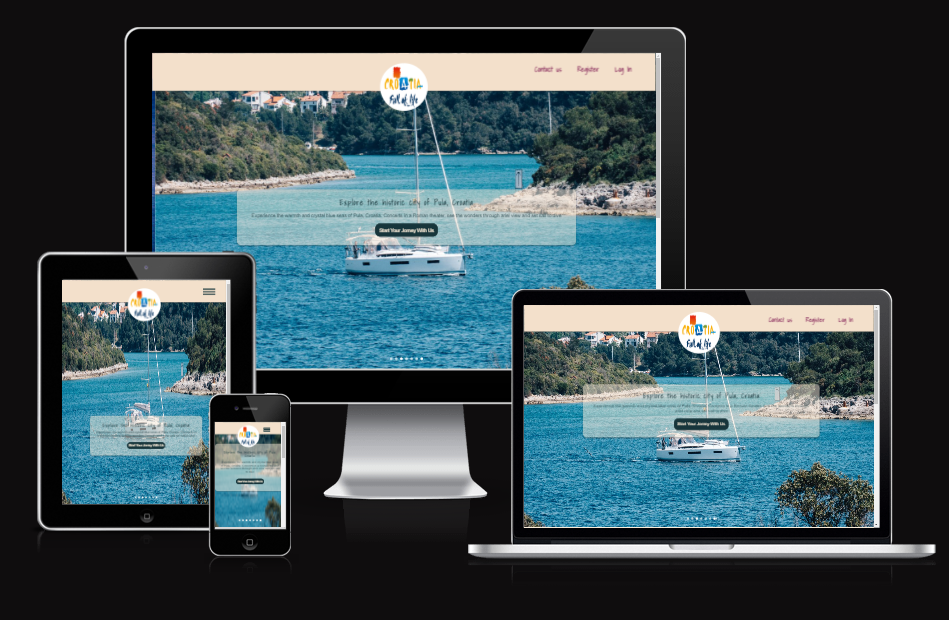

This website is designed to offer a personalized travel experience to Pula, Croatia. It provides customized travel arrangements, including flights, accommodation, and activities for adults, kids, or families. The site aims to showcase the beauty of Pula and the exciting adventures it offers.

## Table of Contents

- [EXPERIENCE PULA CROATIA](#experience-pula-croatia)
  - [Table of Contents](#table-of-contents)
  - [**UX**](#ux)
    - [**Site Purpose**](#site-purpose)
    - [**Site Goal**](#site-goal)
    - [**Current User Goal**](#current-user-goal)
    - [**New User Goal**](#new-user-goal)
    - [**Communication**](#communication)
  - [**Design**](#design)
    - [**Colour Palette**](#colour-palette)
    - [**Typography**](#typography)
    - [**Images**](#images)
  - [**Features**](#features)
    - [**Language Used**](#language-used)
    - [**Navigation Bar**](#navigation-bar)
    - [**Landing Page**](#landing-page)
    - [**Footer**](#footer)
    - [**Future Features**](#future-features)
  - [**Testing**](#testing)
    - [**HTML Validatior Test**](#html-validatior-test)
    - [**CSS Validator Test**](#css-validator-test)
    - [**Lighthouse Mobile**](#lighthouse-mobile)
    - [**Libraries and Progransms used**](#libraries-and-progransms-used)
  - [**Deployment & Usage**](#deployment--usage)
    - [**Deployment**](#deployment)
  - [**Credits**](#credits)
    - [**Media**](#media)

## **UX**

### **Site Purpose**

The website provides a members-only travel assistance platform focused on creating personalized travel experiences in Pula, Croatia. The process starts with a simple travel request form, where users can provide their preferences regarding dates, accommodations, and activities. These details are then forwarded to a personal travel guide who creates a tailored itinerary.

Key Pages:
  - Index Page: Showcases stunning images of Pula in a captivating slideshow, with minimal text and an easy-to-find registration button.
  - Registration Page: Offers a straightforward registration process with prompts for necessary information. Once registered, users are   redirected to their profile page to manage contact details.
  - Travel Request Page: Users submit their travel preferences, including dates, accommodation needs, and activity requests.
  - My Details Page: Allows users to view and update their contact details.
  - Admin Pages: Admins can manage users, travel requests, and track the status of travel arrangements.

#### Who For: 
The website caters to anyone looking to experience Pula, Croatia, including:

  - First-time travelers
  - Families with young children
  - Couples seeking a relaxing vacation
  - Concert goers interested in events at the Pula Arena
  - Repeat visitors looking to explore more of Pula

### **Site Goal**

To provide a one-stop shop for travelers to plan their perfect trip to Pula, Croatia, ensuring every aspect of the journey—flights, accommodation, and activities—is customized to their preferences.

### **Current User Goal**
  - Easy navigation with functional buttons
  - Access to detailed city information
  - Ability to submit a personalized travel request form
  - A user-friendly profile management page with contact info updates
  - A visually appealing landing page with captivating images of Pula

### **New User Goal**
  - Add a new destination to their itinerary for future travel plans.

### **Communication**
The site is designed to be intuitive, ensuring users can easily find what they need. The content focuses on showcasing Pula’s attractions and making the booking process as simple as possible.

## **Design**
### **Colour Palette**

    
  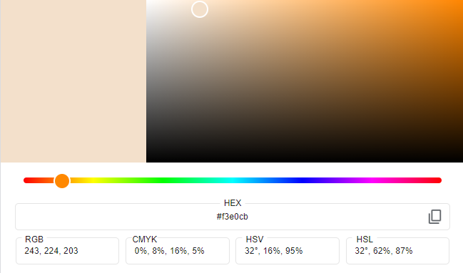  
  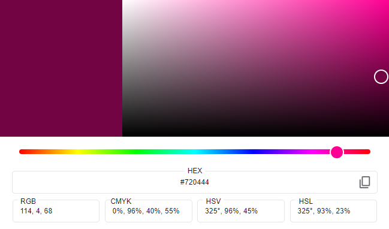   
  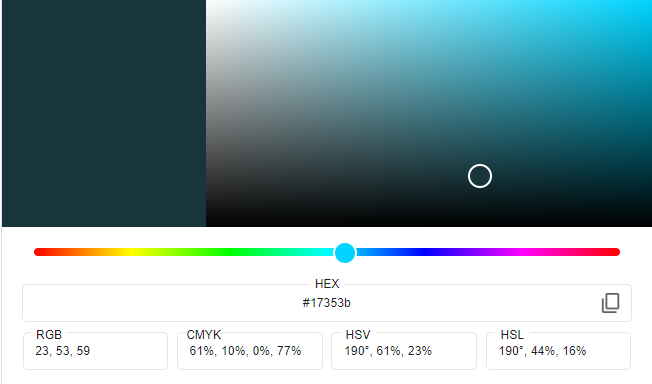
  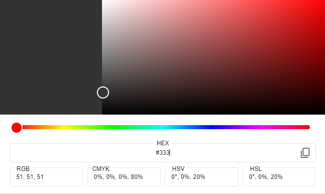
  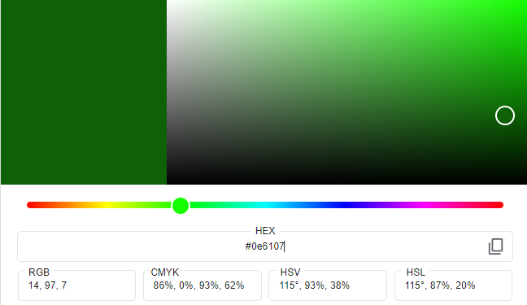
  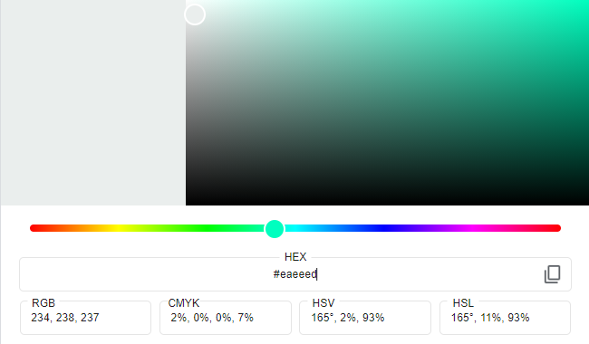
  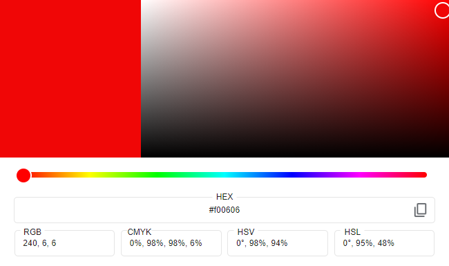
  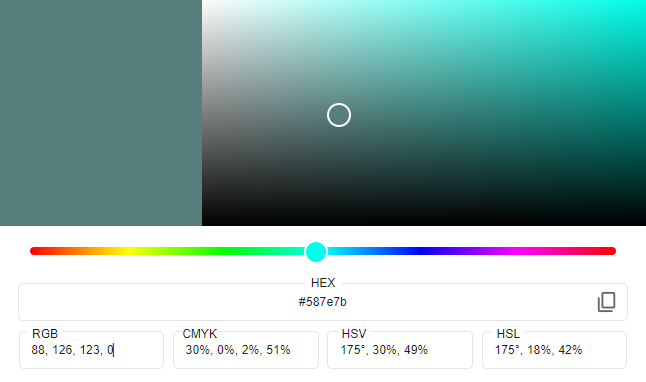
  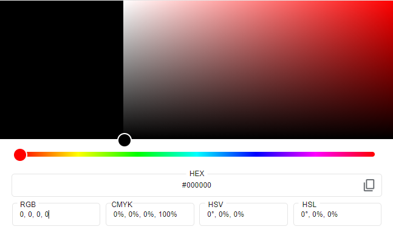
  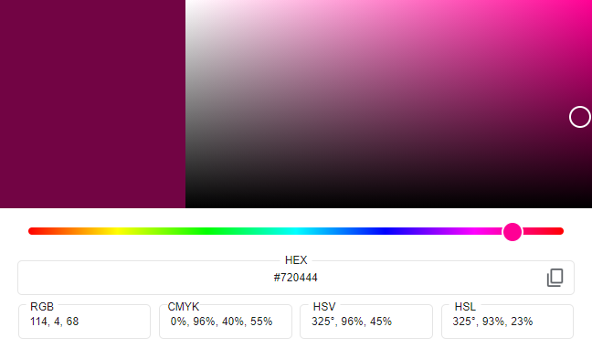
  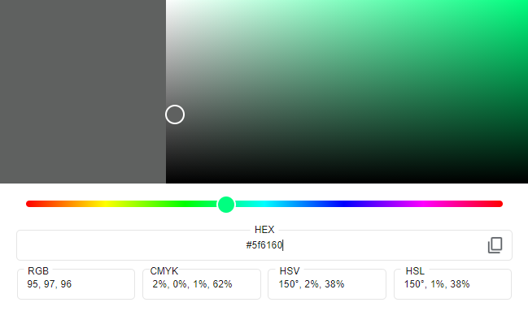
  
  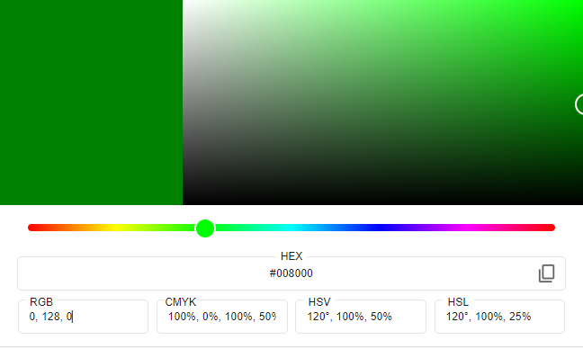

### **Typography**
  - font-family: 'Shadows Into Light', 'Arial Narrow', Arial, cursive;
  

  - font-family: "Questrial", sans-serif;
  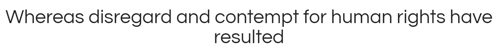

  - font-family: Cambria, Cochin, Georgia, Times, 'Times New Roman', serif; 
  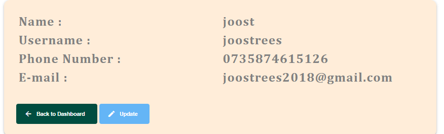

### **Images**
#### Home Page / Carousel / 
- Shuttershock (Paid Subscription)
- Personal Images

#### Registration Page:/Login Page:/Travel Req Page:
- Shuttershock (Paid Subscription)

#### Logo
- Adobe Logo (Paid Subscription)

## **Features**
### NAVIGATION BAR ON ALL PAGES WITH ACTIVE HIGHLIGHT
  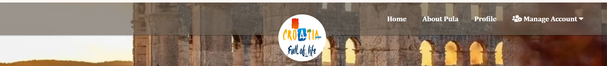

  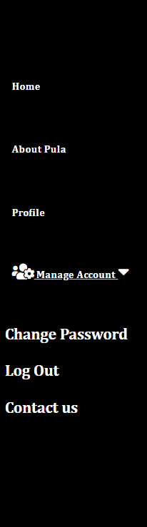

   -  The navigation bar is simple, clear, and features active highlights to show users which page they are on. It turns into a toggle button on smaller screens, making it mobile-friendly.

### CAPTURING USERS ATTENTION WITH CAROUSEL 

  

   -  The home page features a captivating image carousel to quickly engage users with stunning visuals of Pula, sparking interest in the destination. 

### SOCIAL LINKS

  

  - The footer contains links to social media platforms, making it easier for users to stay connected and discover more about Pula’s offerings.

### review
  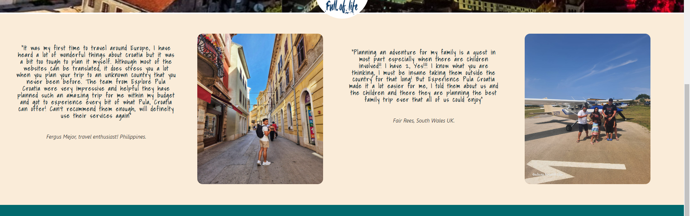

  - Putting a few reviews instantly visible gives a massive inpact to the users without having to be looking around.

### ADMIN FUNCTIONALITY
  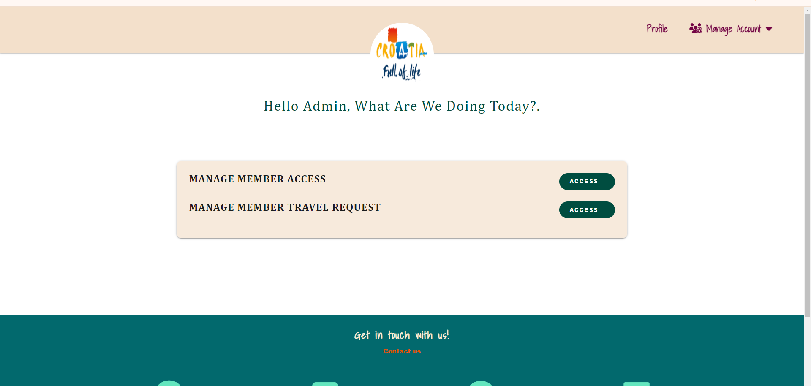

  - Admin users have the ability to manage accounts, travel requests, and update statuses for completed or pending travel arrangements. 

  ### CONTACT PAGE 
  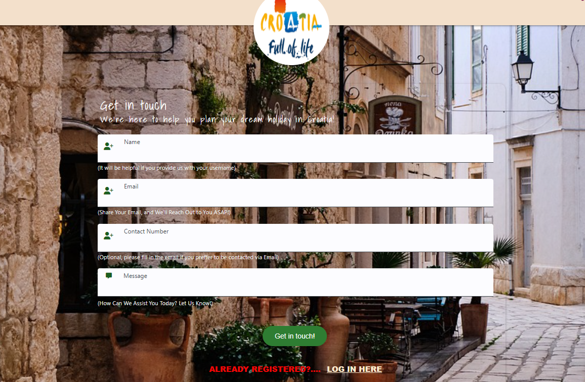

  - A contact page is available for both registered users and visitors who may have inquiries before registering. 

  ### REGISTER PAGE 
  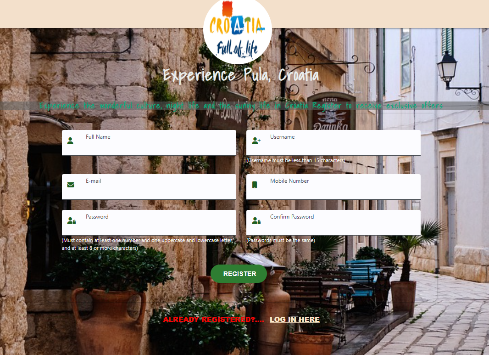

  - The registration page is straightforward, with clear instructions for users to create their profiles and request personalized travel experiences.

### **Language Used**
  - English

### **Navigation Bar**
- I have used Materialized for my Navigation bar which basic functionality for easy use. Using Bootstrap helps with the mobile first functionality of my website. Apart from this I have also added a highlight on the current page that the user is on. 

### **Landing Page**
- My landing page speaks for itself, the cover photo shows what the site is for and about. It also has my personal introduction which explains about the site. 

### **Footer**
- Social Media links which uses fontawesome icons to make it look appealing.

### **Future Features**
- I was hoping to add a little bit more pages to offer other services but I havent got a lot of time to finish this project.

## **Testing**
### Bugs and Issues

  - #### IDE Issues
    - My IDE crashed because I cleared my cookies and it caused my HEROKO to logged me out and lock me out, it took me a while to figure it out but then It was showing in GITHUB that the HEROKU was failing. Relaize that I was also logged out from the CI student account. 
  - #### Code Issues
    
    - While creating my flask app, I could not seem to load up the site at first, reason because the version was not correct. I did a little bit of research and tried it out myself but could not fix it. With the help of student support they pointed me to the right direction.

    - On the earliest stage of building the site, I didn't have much issues with coding but then. When I was trying to code a Delete route that passes to a Materialize Modal, I could not seem to pass it through the modal only to find out that instead of using the user I added username. This is for the delte functionality in the Admin page.

    - The same issue occured when I was trying to figure out to Delete the current Travel request passing through Materialize Modal. It keeps saying that I have too many reroutes to the newTravel page, removing the the redirection code in the newTravle,html but it causes my admin page to fail. I tried to find a way to fix it without creating another page but the only feesable solution was to create another page that renders the travel info data the same as the newTravel. 

    - Making my website responsive to screen size:

          Apart from bootstrap I also have used media queries which I followed from "LOVE RUNNING mini project"

### **HTML Validatior Test**

    It showed quite a few errors that I have already fixed but I wasn't able to get a screenshot of. 
  - Base/Index - 
https://validator.w3.org/nu/?doc=https%3A%2F%2Fexperience-croatia-032eba8fb52c.herokuapp.com%2Findex.html

  - About - 
https://validator.w3.org/nu/?doc=https%3A%2F%2Fexperience-croatia-032eba8fb52c.herokuapp.com%2Fabout

  - Contact -
https://validator.w3.org/nu/?doc=https%3A%2F%2Fexperience-croatia-032eba8fb52c.herokuapp.com%2Fcontact

  - Registration - 
https://validator.w3.org/nu/?doc=https%3A%2F%2Fexperience-croatia-032eba8fb52c.herokuapp.com%2Fregister

  - Login Page - 
https://validator.w3.org/nu/?doc=https%3A%2F%2Fexperience-croatia-032eba8fb52c.herokuapp.com%2Flogin

  - User Profile Page - 
https://validator.w3.org/nu/?doc=https%3A%2F%2Fexperience-croatia-032eba8fb52c.herokuapp.com%2Fprofile%2Ftest2

  - User Info Page - 
https://validator.w3.org/nu/?doc=https%3A%2F%2Fexperience-croatia-032eba8fb52c.herokuapp.com%2Fmyinfo

USER TRAVEL REQ
https://validator.w3.org/nu/?doc=https%3A%2F%2Fexperience-croatia-032eba8fb52c.herokuapp.com%2FnewTravel

CHANGEPASS
https://validator.w3.org/nu/?doc=https%3A%2F%2Fexperience-croatia-032eba8fb52c.herokuapp.com%2Fchangepass

ADMIN Profile page 
https://validator.w3.org/nu/?doc=https%3A%2F%2Fexperience-croatia-032eba8fb52c.herokuapp.com%2Fprofile%2Fsystemadmin

ADMIN user manager
https://validator.w3.org/nu/?doc=https%3A%2F%2Fexperience-croatia-032eba8fb52c.herokuapp.com%2Fmanageusers%2Fsystemadmin

ADMIN travel request manager 
https://validator.w3.org/nu/?doc=https%3A%2F%2Fexperience-croatia-032eba8fb52c.herokuapp.com%2FnewTravel

USER TRAVEL REQUEST FORM
https://validator.w3.org/nu/?doc=https%3A%2F%2Fexperience-croatia-032eba8fb52c.herokuapp.com%2Ftravel_info

UPDATE USER INFO
https://validator.w3.org/nu/?doc=https%3A%2F%2Fexperience-croatia-032eba8fb52c.herokuapp.com%2Fupdate%2F6761abae09aec3a80580361b

  

### **CSS Validator Test**
  - style.css - 
https://jigsaw.w3.org/css-validator/validator?uri=https%3A%2F%2Fexperience-croatia-032eba8fb52c.herokuapp.com%2Fstatic%2Fcss%2Fstyle.css&profile=css3svg&usermedium=all&warning=1&vextwarning=&lang=en

### **JS Validator Test**
  - script
  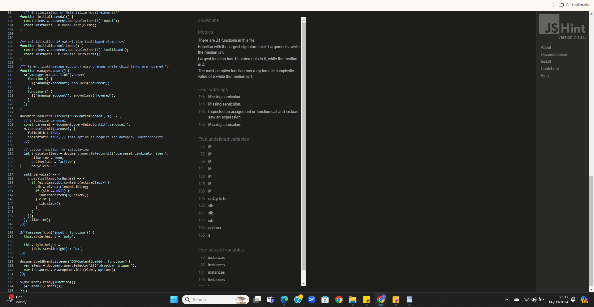 

  There are still errors in here however these are needed in my code to work

### **Flask testing**

I have been trying to find somewhere I could test my app. I did come across with Pytest but it seems so complicated. I did not dare push through with it but would def find time to go into details. 

## **Libraries and Programs used**
- Materialize 1.0.0
- Github: Store Repositor
- Gitpod: To create the html and css file
- Google Fonts: Font family "Playfair", sans-serif;
- Font Awesome: Dropdown menu icon
- UI.DEV: Responsive screenshots of the final project for the README file
- Squoosh app/editor
- Online image converter
- stackoverflow
- w3 checkers
- js hint

## **Deployment & Usage**
### **Deployment**
To deploy my site on Git Hub I made the following steps. I found out how to deploy my project when I was playing around with github trying to fix my incorrect path which hinders my images to load up on live. 

These are the steps:

 - Go to the Settings tab of your GitHub repo.
 - On the left-hand sidebar, in the Code and automation section, select Pages.
 - Make sure: Source is set to 'Deploy from Branch'.
 - Main branch is selected.
 - Folder is set to / (root).
 - Under Branch, click Save.
 - Go back to the Code tab. Wait a few minutes for the build to 
 - finish and refresh your repo.
 - On the right-hand side, in the Environments section, click on 'github-pages'.
 - Click View deployment to see the live site

### **Fork**
  1.  On GitHub.com, navigate to the experience-croatia repository.
  2.  In the top-right corner of the page, click Fork.
  3.  Under "Owner," select the dropdown menu and click an owner for the forked repository.
  4.  By default, forks are named the same as their upstream repositories. Optionally, to further distinguish your fork, in the "Repository name" field, type a name.
  5.  Optionally, in the "Description" field, type a description of your fork.
  6.  Optionally, select Copy the DEFAULT branch only.
  7.  Click Create fork.

### **Cloning**
  1.  On GitHub.com, navigate to your fork of the Spoon-Knife repository.
  2.  Above the list of files, click  Code.
  3.  Copy the URL for the repository.
    - To clone the repository us
    itory using an SSH key, including a certificate issued by your organization's SSH certificate authority, click SSH, then click .
    - To clone a repository using GitHub CLI, click GitHub CLI, then click .
  4.  Open Git Bash.
  5.  Change the current working directory to the location where you want the cloned directory.
  6.  Type git clone, and then paste the URL you copied earlier. It will look like this, with your GitHub username instead of YOUR-USERNAME:
  7.  Press Enter. Your local clone will be created.

## **Credits**
 - versions of the app that needed to be changed in the requirements.txt
    - 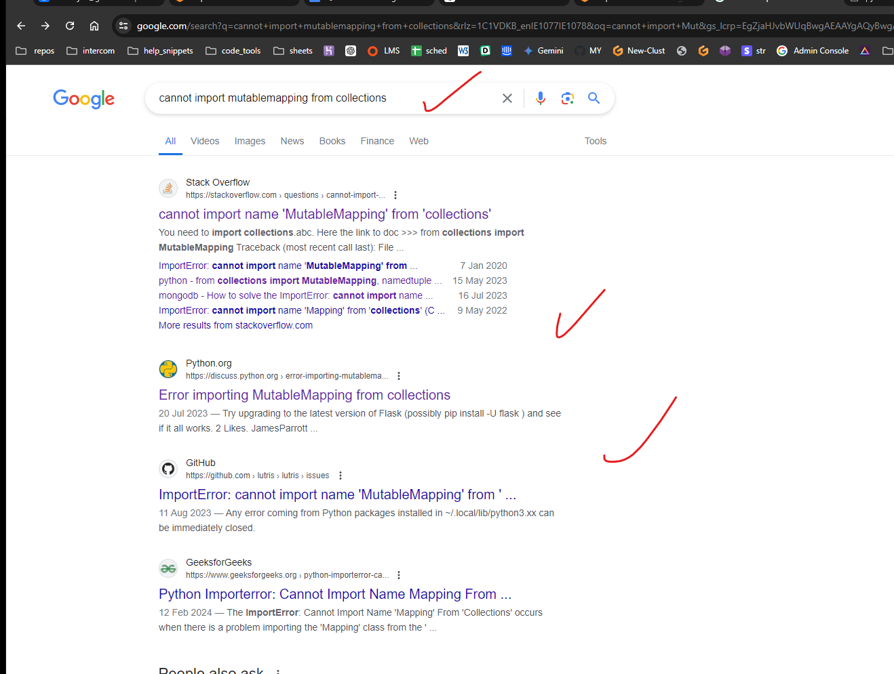  
 - Problems with deployment when images were not loading up
    - initial information was from Stackoverflow but nothing was copied from them. 
    - Guidance was given by my mentor Danielle Hamilton.
- compressing Images
  - https://squoosh.app/

- Confirmation Page Idea (This is will be made interactive during Java script milestone)
The Idea is to make the contact page look interactive and to show the benefits of it. 
  -  Daniel Hamilton

- Embed video instructions from
  - Code Institue 
  - W3schools

- Some content from
  - https://www.legislation.gov.uk/ukpga/1985/68/contents

- Image converting from jpg to webp
  https://image.online-convert.com/convert-to-webp

- Lighthouse Information Guidelines Info 
Lightouse

borrowd some code from my co-student Mika Virtubo 

### **Media**

Media are either personal Photos or paid subscription from shutterstock. 
  