# Experience PULA CROATIA

### Welcome to EXPERIENCE PULA CROATIA!

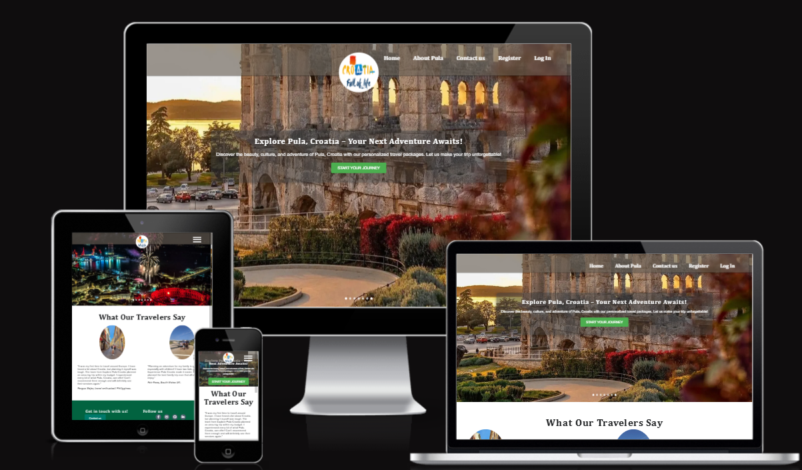

This website is designed to offer a personalized travel experience to Pula, Croatia. It provides customized travel arrangements, including flights, accommodation, and activities for adults, kids, or families. The site aims to showcase the beauty of Pula and the exciting adventures it offers.

## Table of Contents

- [EXPERIENCE PULA CROATIA](#experience-pula-croatia)
  - [Table of Contents](#table-of-contents)
  - [**UX**](#ux)
    - [**Site Purpose**](#site-purpose)
    - [**Site Goal**](#site-goal)
    - [**Current User Goal**](#current-user-goal)
    - [**New User Goal**](#new-user-goal)
    - [**Communication**](#communication)
  - [**Design**](#design)
    - [**Colour Palette**](#colour-palette)
    - [**Typography**](#typography)
    - [**Images**](#images)
  - [**Features**](#features)
    - [**Language Used**](#language-used)
    - [**Navigation Bar**](#navigation-bar)
    - [**Landing Page**](#landing-page)
    - [**Footer**](#footer)
    - [**Future Features**](#future-features)
  - [**Testing**](#testing)
    - [**HTML Validatior Test**](#html-validatior-test)
    - [**CSS Validator Test**](#css-validator-test)
    - [**Lighthouse Mobile**](#lighthouse-mobile)
    - [**Libraries and Progransms used**](#libraries-and-progransms-used)
  - [**Deployment & Usage**](#deployment--usage)
    - [**Deployment**](#deployment)
  - [**Credits**](#credits)
    - [**Media**](#media)

## **UX**

### **Site Purpose**

The website provides a members-only travel assistance platform focused on creating personalized travel experiences in Pula, Croatia. The process starts with a simple travel request form, where users can provide their preferences regarding dates, accommodations, and activities. These details are then forwarded to a personal travel guide who creates a tailored itinerary.

Key Pages:
  - Index Page: Showcases stunning images of Pula in a captivating slideshow, with minimal text and an easy-to-find registration button.
  - Registration Page: Offers a straightforward registration process with prompts for necessary information. Once registered, users are   redirected to their profile page to manage contact details.
  - Travel Request Page: Users submit their travel preferences, including dates, accommodation needs, and activity requests.
  - My Details Page: Allows users to view and update their contact details.
  - Admin Pages: Admins can manage users, travel requests, and track the status of travel arrangements.

#### Who For: 
The website caters to anyone looking to experience Pula, Croatia, including:

  - First-time travelers
  - Families with young children
  - Couples seeking a relaxing vacation
  - Concert goers interested in events at the Pula Arena
  - Repeat visitors looking to explore more of Pula

### **Site Goal**

To provide a one-stop shop for travelers to plan their perfect trip to Pula, Croatia, ensuring every aspect of the journey—flights, accommodation, and activities—is customized to their preferences.

### **Current User Goal**
  - Easy navigation with functional buttons
  - Access to detailed city information
  - Ability to submit a personalized travel request form
  - A user-friendly profile management page with contact info updates
  - A visually appealing landing page with captivating images of Pula

### **New User Goal**
  - Add a new destination to their itinerary for future travel plans.

### **Communication**
The site is designed to be intuitive, ensuring users can easily find what they need. The content focuses on showcasing Pula’s attractions and making the booking process as simple as possible.

## **Design**
### **Colour Palette**

    
     
  
  
  
  
  
  
  

### **Typography**
  - font-family: 'Shadows Into Light', 'Arial Narrow', Arial, cursive;
  - font-family: "Questrial", sans-serif;
  - font-family: Cambria, Cochin, Georgia, Times, 'Times New Roman', serif; 

### **Images**
#### Home Page / Carousel / 
- Shuttershock (Paid Subscription)
- Personal Images

#### Registration Page:/Login Page:/Travel Req Page:
- Shuttershock (Paid Subscription)

#### Logo
- Adobe Logo (Paid Subscription)

## **Features**
### NAVIGATION BAR ON ALL PAGES WITH ACTIVE HIGHLIGHT
  

  

### CAPTURING USERS ATTENTION WITH CAROUSEL 

   -  The home page features a captivating image carousel to quickly engage users with stunning visuals of Pula, sparking interest in the destination. 

### SOCIAL LINKS

  

  - The footer contains links to social media platforms, making it easier for users to stay connected and discover more about Pula’s offerings.

### review

  - Putting a few reviews instantly visible gives a massive inpact to the users without having to look around.

### ADMIN FUNCTIONALITY

  - Admin users have the ability to manage accounts, travel requests, and update statuses for completed or pending travel arrangements. 

### CONTACT PAGE 

  - A contact page is available for both registered users and visitors who may have inquiries before registering. 

### REGISTER PAGE 

  - The registration page is straightforward, with clear instructions for users to create their profiles and request personalized travel experiences.

### **Language Used**
  - English

### **Navigation Bar**
- I have used Materialized for my Navigation bar which has a basic functionality for easy use.

### **Landing Page**
- My landing page speaks for itself, the cover photo shows what the site is for and what it is about. Furthermore, users could also navigate to the About Pula Page where users can read about what Pula can offer. 

### **Footer**
- Social Media links which uses fontawesome icons to make it look appealing.

### **Future Features**
- Add another destination still targeting Croatia, but istead of just Pula the site could offer other places Zagreb, Split, Zadar etc.  

## **Testing**
### Bugs and Issues

  - #### Code Issues

    - In the early stages of building the site, coding went smoothly without many issues. However, when I attempted to create a Delete route for the Admin Page that worked with a Materialize Modal, I ran into a problem. The route wasn’t passing through the modal correctly. After investigating, I realized that the issue was due to using "username" instead of "user". 

    - There were DATA's that were not reflecting in the backend(MONGODB) such as the travel date flexibility and the departure port. In the app.py file the names were incorrectly misspelled causing the backend not to store it and as well render to another page. 

    - The Admin page and user page was not properly responding to each other, I figured out how to do one route to render the travel_info form. Instead of having newTravel and manageTravel I have combined both now only using just the newTravel to render travekl_info's in both user and admin pages. See below flow chart.

    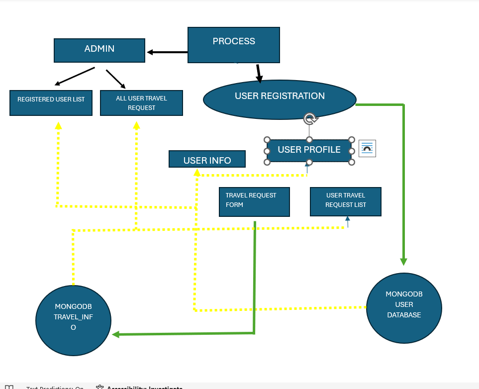

  
  - #### UI Issues
   - Many users will access the app from mobile devices, so the UI must adapt accordingly and making sure that designing the app for mobile responsiveness. Apart from using materialize, I find media queries useful especially when defining a specific part you want to respond when the screen goes smaller. For example the About Pula page, when the screen goes smaller the font's doesn't seem to respond, with the help of media queries I was able to make the fonts the size I find fitting for the size screen. 

### **HTML Validatior Test**

    It showed quite a few errors that I have already fixed but I wasn't able to get a screenshot of. 
  - Base/Index - 
https://validator.w3.org/nu/?doc=https%3A%2F%2Fexperience-croatia-032eba8fb52c.herokuapp.com%2F

  - About - 
https://validator.w3.org/nu/?doc=https%3A%2F%2Fexperience-croatia-032eba8fb52c.herokuapp.com%2Fabout

  - Contact -
https://validator.w3.org/nu/?doc=https%3A%2F%2Fexperience-croatia-032eba8fb52c.herokuapp.com%2Fcontact

  - Contact / thank-you
https://validator.w3.org/nu/?doc=https%3A%2F%2Fexperience-croatia-032eba8fb52c.herokuapp.com%2Fthank_you

  - Registration - 
https://validator.w3.org/nu/?doc=https%3A%2F%2Fexperience-croatia-032eba8fb52c.herokuapp.com%2Fregister

  - Login Page - 
https://validator.w3.org/nu/?doc=https%3A%2F%2Fexperience-croatia-032eba8fb52c.herokuapp.com%2Flogin

  - User Profile Page - 
https://validator.w3.org/nu/?doc=https%3A%2F%2Fexperience-croatia-032eba8fb52c.herokuapp.com%2Fprofile%2Ftest2

  - User Travel_info Request - 
https://validator.w3.org/nu/?doc=https%3A%2F%2Fexperience-croatia-032eba8fb52c.herokuapp.com%2Ftravel_info

  - User Personal Account Info Page / UPDATE INFO PAGE - 
https://validator.w3.org/nu/?doc=https%3A%2F%2Fexperience-croatia-032eba8fb52c.herokuapp.com%2Fmyinfo

https://validator.w3.org/nu/?doc=https%3A%2F%2Fexperience-croatia-032eba8fb52c.herokuapp.com%2Fupdate%2F6761abae09aec3a80580361b

  - User Travel Request List Page / UPDATE TRAVEL INFO PAGE -
https://validator.w3.org/nu/?doc=https%3A%2F%2Fexperience-croatia-032eba8fb52c.herokuapp.com%2FnewTravel

https://validator.w3.org/nu/?doc=https%3A%2F%2Fexperience-croatia-032eba8fb52c.herokuapp.com%2FupdateTravel%2F67640e47bcd1db962961bbeb

  - Change Password Page -
https://validator.w3.org/nu/?doc=https%3A%2F%2Fexperience-croatia-032eba8fb52c.herokuapp.com%2Fchangepass

  -Admin Profile -
https://validator.w3.org/nu/?doc=https%3A%2F%2Fexperience-croatia-032eba8fb52c.herokuapp.com%2Fprofile%2Fsystemadmin

 - ADMIN user manager - 
https://validator.w3.org/nu/?doc=https%3A%2F%2Fexperience-croatia-032eba8fb52c.herokuapp.com%2Fmanageusers%2Fsystemadmin

  - ADMIN travel request manager -
https://validator.w3.org/nu/?doc=https%3A%2F%2Fexperience-croatia-032eba8fb52c.herokuapp.com%2FnewTravel

### **CSS Validator Test**
  - style.css - 
https://jigsaw.w3.org/css-validator/validator?uri=https%3A%2F%2Fexperience-croatia-032eba8fb52c.herokuapp.com%2Fstatic%2Fcss%2Fstyle.css&profile=css3svg&usermedium=all&warning=1&vextwarning=&lang=en

  - media-queries.css -
https://jigsaw.w3.org/css-validator/validator?uri=https%3A%2F%2Fexperience-croatia-032eba8fb52c.herokuapp.com%2Fstatic%2Fcss%2Fmedia-queries.css&profile=css3svg&usermedium=all&warning=1&vextwarning=&lang=en

### **JS Validator Test**
  - script
  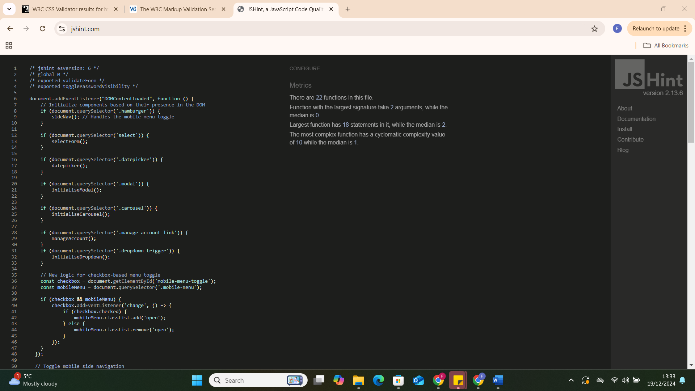 

  There were errors but the errors does not cause any problems on my javascript

    1. These are the majority of errors (see below) I have which can be solved by adding this on top of the code /* jshint esversion: 6 */ 

      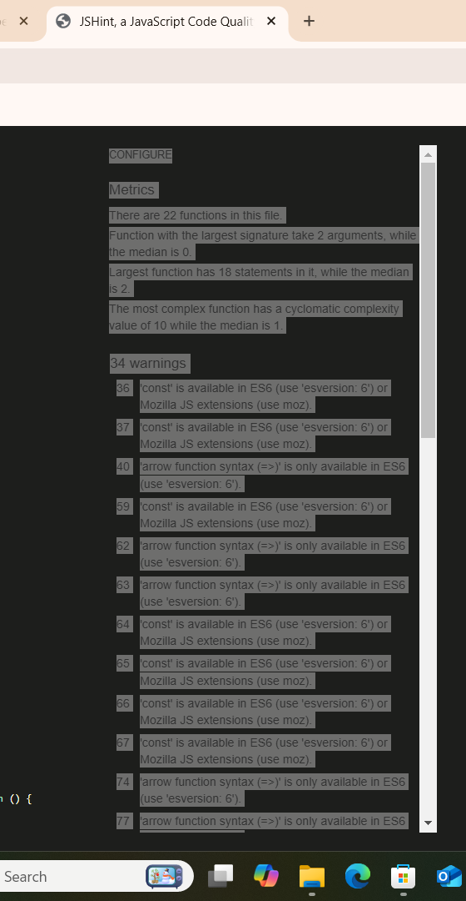 

    2. Undefined Variable 

          "M" was showing undefined but the "M" is a global variable. For it not to show as error I have placed /* global M */ on line 2 in the jshint validator.

    3. Unused variables error which are Two unused variable in line 154	togglePasswordVisibility and 168	validateForm 
    
        - These are used, if I removed the togglePasswordVisiility I would not be able to see if the password that I entered in resgistration form and changepassword form same as the validation form, this is used to validate the inputs in the form before submitting it not allowing the user to go forward if none of the requested information has been satisfies based on it's requirement. 
        
        So to ignore this in jshint I have added these /* exported validateForm */ , /* exported togglePasswordVisibility */

### **Lighthouse**
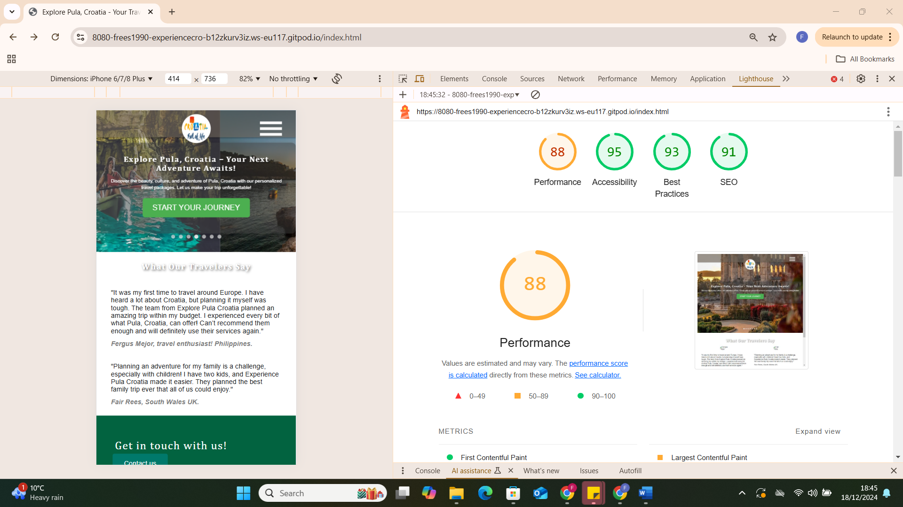 
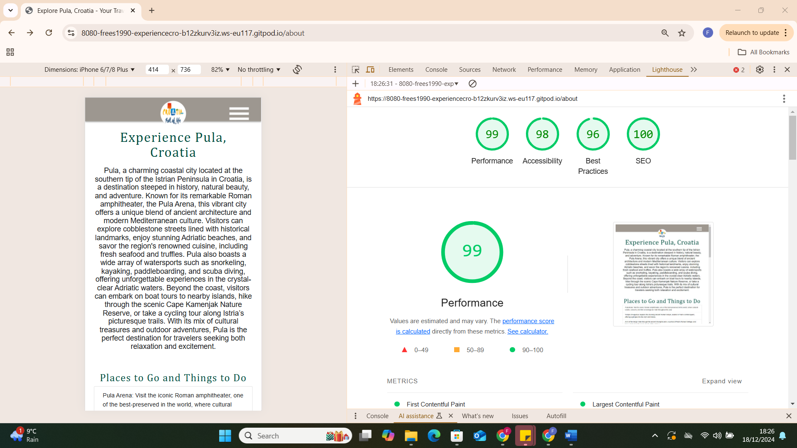 
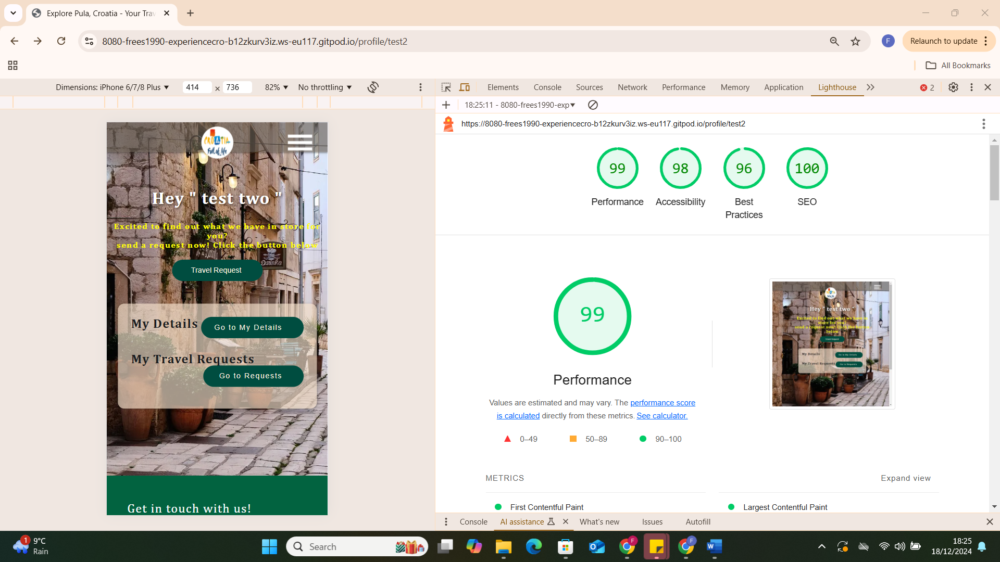 
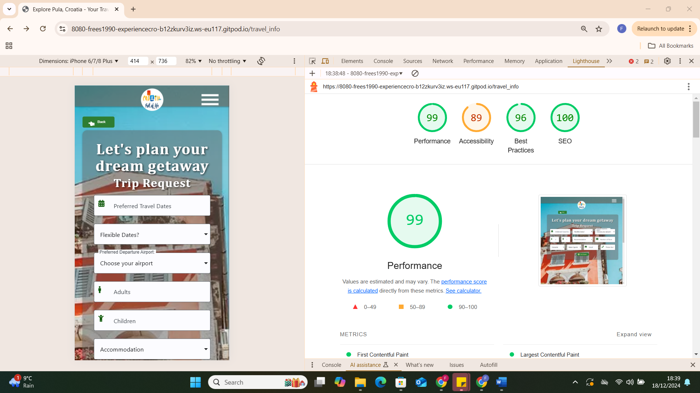 
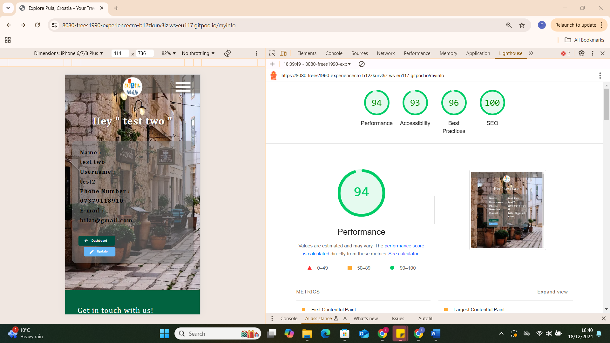 
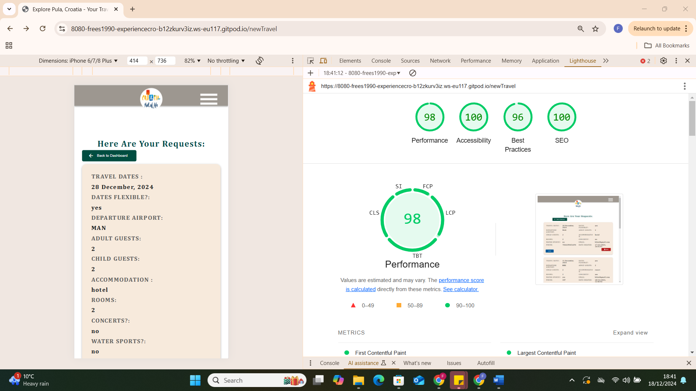 
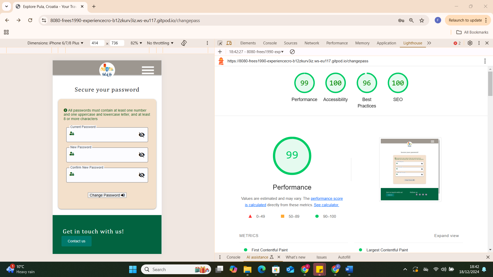 
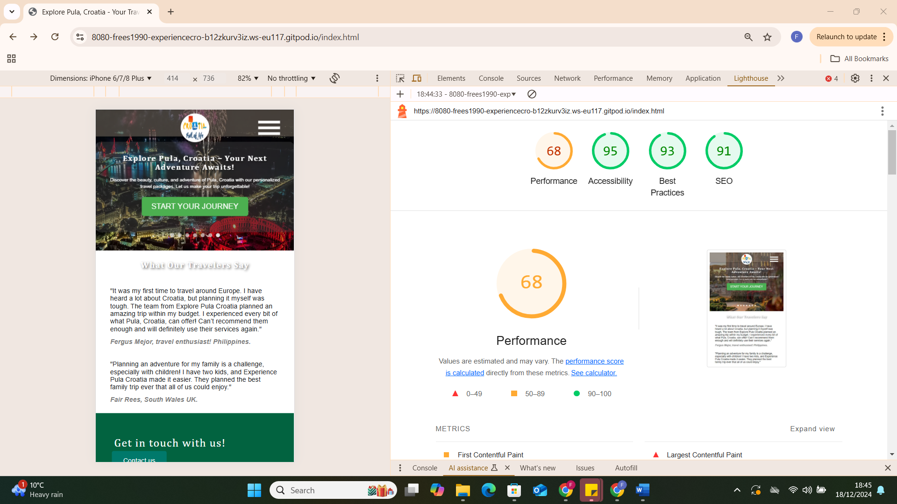 
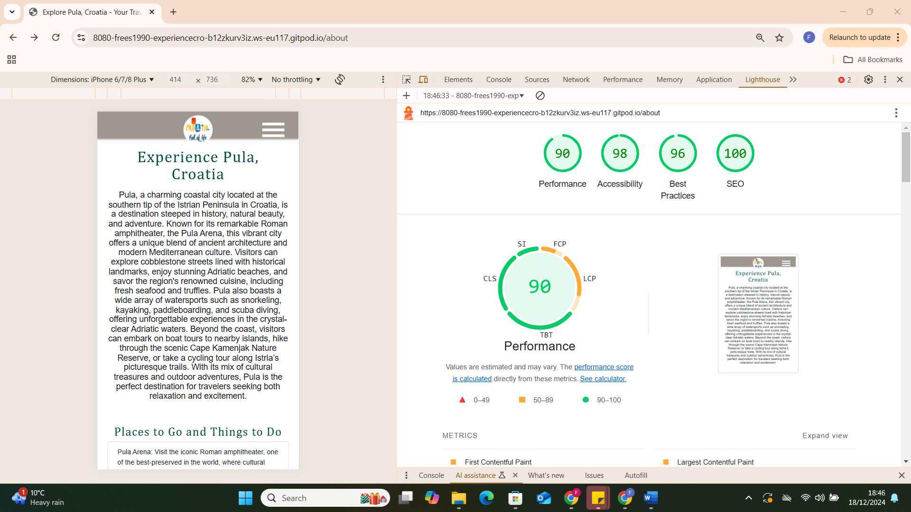 
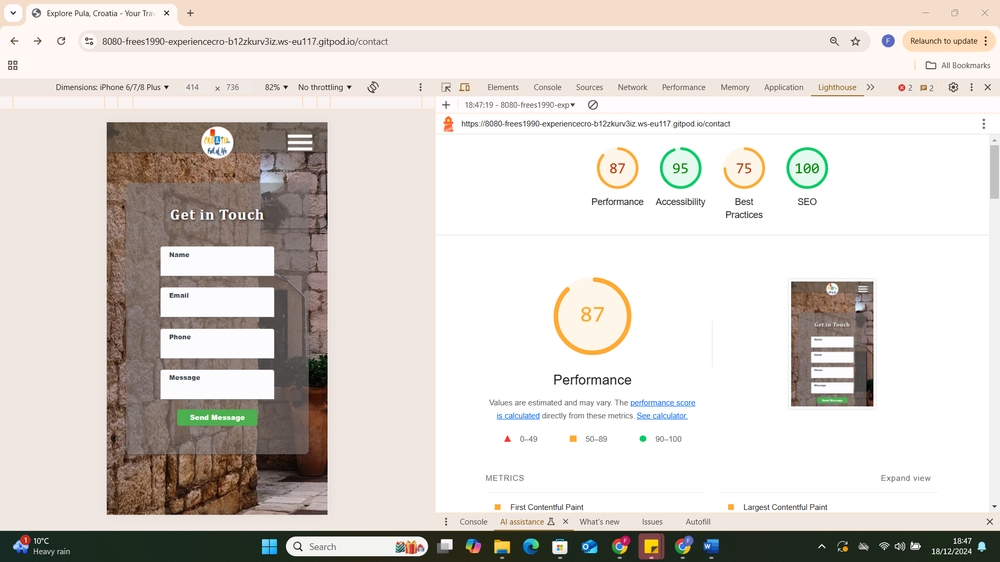 
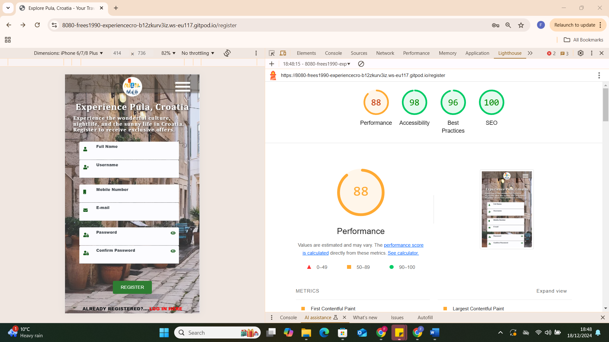 
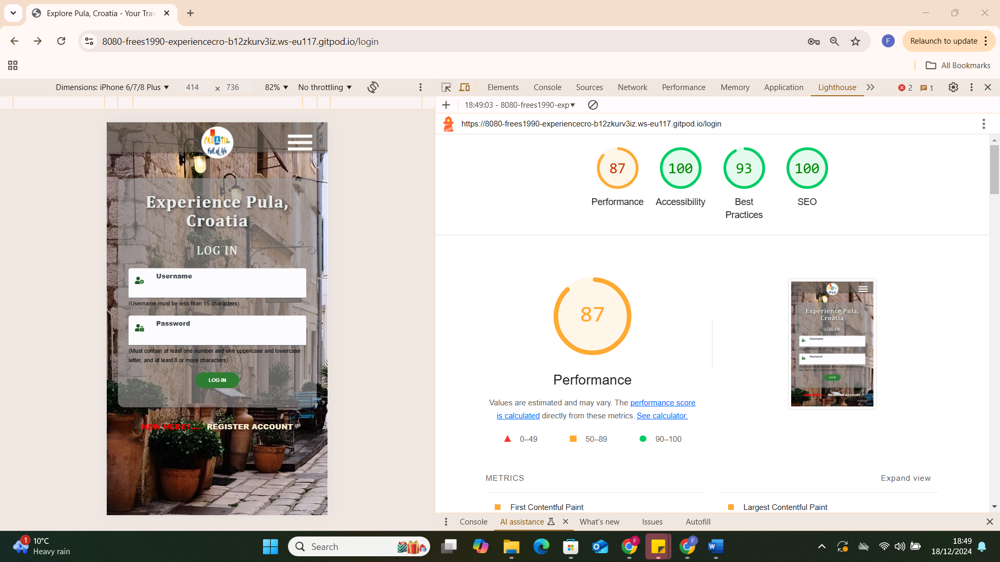 
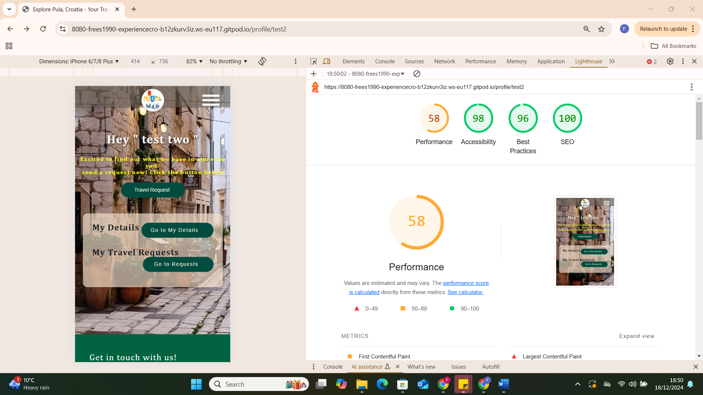 
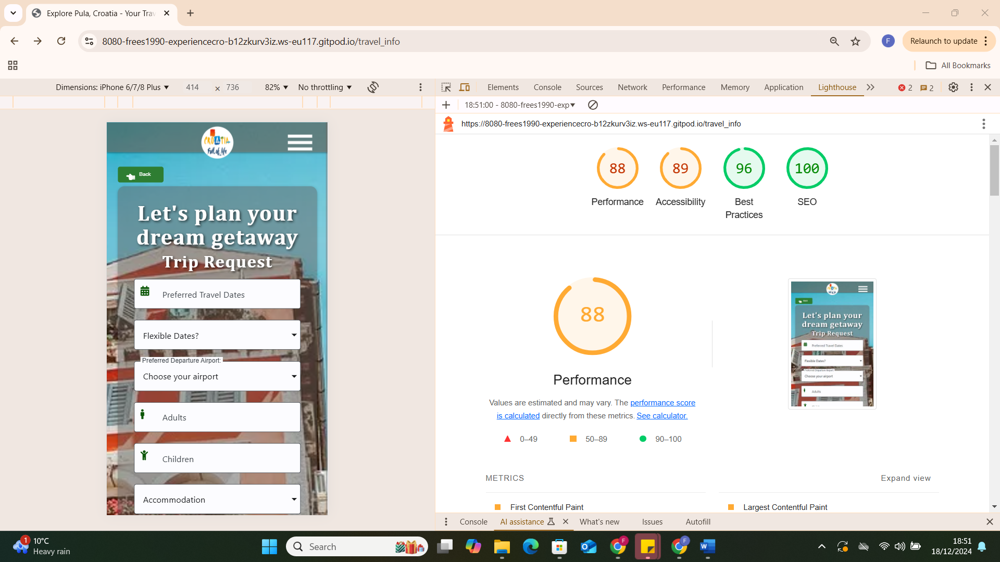 
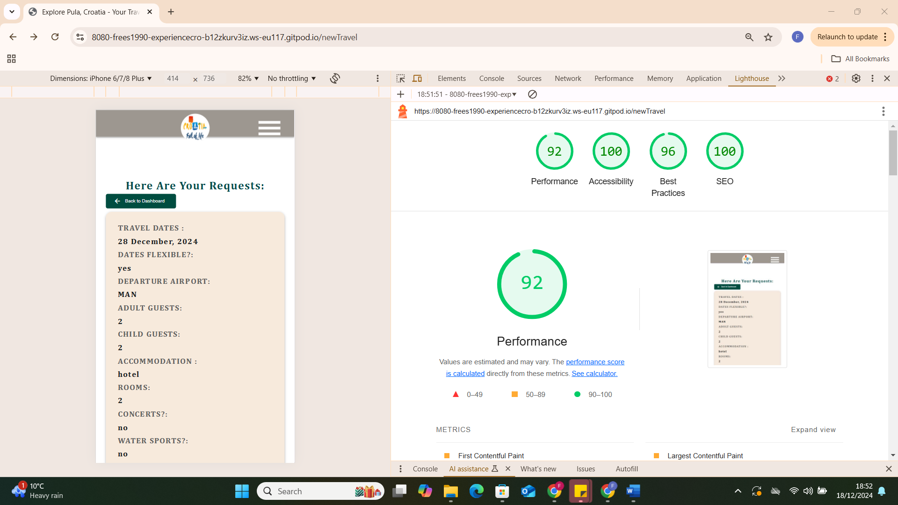 
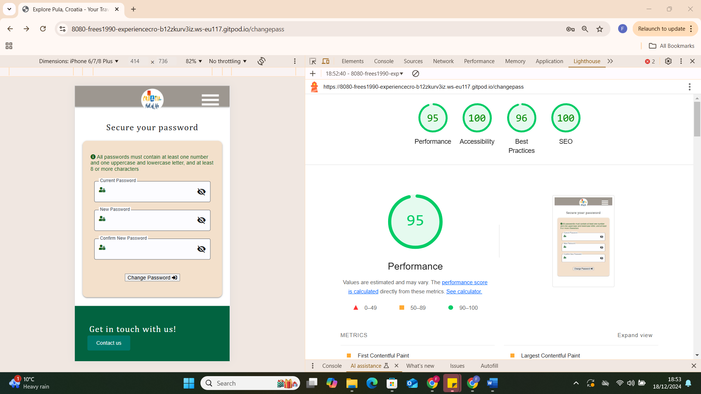 

## **Libraries and Programs used**
- Materialize 1.0.0
- Github: Store Repositor
- Gitpod: To create the html and css file
- Google Fonts: Font family "Playfair", sans-serif;
- Font Awesome: Dropdown menu icon
- UI.DEV: Responsive screenshots of the final project for the README file
- Squoosh app/editor
- Online image converter
- stackoverflow
- w3 checkers
- js hint
- E-mail JS
- blinker==1.9.0
- click==8.1.7
- dnspython==2.7.0
- Flask==3.1.0
- Flask-Mail==0.10.0
- Flask-PyMongo==2.3.0
- Flask-SQLAlchemy==2.5.1
- Flask-WTF==1.2.2
- greenlet==3.1.1
- itsdangerous==2.2.0
- numpy==2.1.3
- pandas==2.2.3
- psycopg2==2.9.10
- pymongo==4.10.1
- python-dotenv==1.0.1
- pytz==2024.2
- SQLAlchemy==1.4.46
- tzdata==2024.2
- Werkzeug==3.1.3
- WTForms==3.2.1

## **Deployment & Usage**
### **Deployment**

  1. Set Up Your Flask App for Deployment
    - Ensure your Flask app follows the correct structure.
    - Install necessary libraries
  2. Create a Procfile
  3. Initialize Git
  4. Create a Heroku Account
  5. Log In to Heroku
  6. Create a New Heroku App
  7. Configure Environment Variables
      - Go to settings 
      - Click Reveal Config Vars 
      - Copy the ones in your env.py file
      Sample env.py file:
        import os

        os.environ.setdefault("IP", "0.0.0.0")
        os.environ.setdefault("PORT", "5000")
        os.environ.setdefault("SECRET_KEY", "replace with your own value")
        os.environ.setdefault("MONGO_URI", "replace with your own value")
        os.environ.setdefault("MONGO_DBNAME", "replace with your own dbname")
  8. Navigate to Deploy 
      - Connect to Github
      - Find your repository "example: experience_croatia" click connect
      - Click Enable Automatic Deploys 
      - Make sure to choose main then cick on deploy. 

### **Fork**
  
  By forking a GitHub repository, you create a copy of the original repository under your own GitHub account. This allows you to view or make changes independently without impacting the original repository. To fork this repository, follow these steps:

  1. Log in to GitHub and locate this GitHub Repository experience_croatia.
  2. At the top of the Repository (not top of page) just above the "Settings" Button on the menu, locate the "Fork" Button.
  3. Once clicked, you should now have a copy of my original repository in your own GitHub account!

### **Cloning**
  You can clone the repository by following these steps:

  1. Go to the GitHub repository.
  2. Locate the Code button above the list of files and click it.
  3. Select if you prefer to clone using HTTPS, SSH, or GitHub CLI and click the copy button to copy the URL to your clipboard.
  4. Open Git shell or Terminal.
  5. Change the current working directory to the one where you want the cloned directory.
  6. In your IDE Terminal, type the following command to clone my repository:
          git clone https://github.com/Frees1990/experience_croatia.git
Press Enter to create your local clone.

## **Credits**

 - Problems with deployment when images were not loading up I got the information on how to solve it from the list bellow 
    - initial information was from Stackoverflow but nothing was copied from them. 
    - Guidance was given by my mentor Danielle Hamilton.

- compressing Images
  - https://squoosh.app/

- Embed video instructions and information about flask app, how to start it and how it works. 
  - Code Institue 
  - W3schools

- Image converting from jpg to webp
  https://image.online-convert.com/convert-to-webp

- Change password page and Hamburger 
  Idea was taken from Mika Virtucio(Co-student code institute)

### **Media**

Media are either personal Photos or paid subscription from shutterstock. 
  