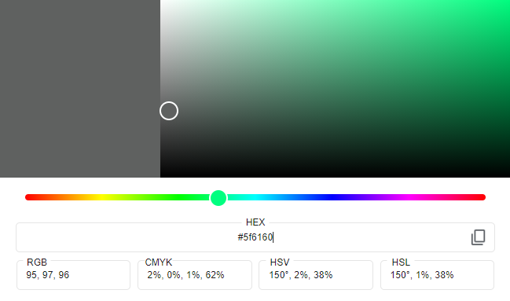

# Experience PULA CROATIA

### Welcome to EXPERIENCE PULA CROATIA!

This website is created for the intention of offering full package travel experience to Pula Croatia, it offers personalize travel arrangement from flights, accommodation, experiences for adults, kids or both. This website is to showcase the beautiful city of Pula and the amazing adventures it could offer. 

## Table of Contents

- [EXPERIENCE PULA CROATIA](#experience-pula-croatia)
  - [Table of Contents](#table-of-contents)
  - [**UX**](#ux)
    - [**Site Purpose**](#site-purpose)
    - [**Site Goal**](#site-goal)
    - [**Current User Goal**](#current-user-goal)
    - [**New User Goal**](#new-user-goal)
    - [**Communication**](#communication)
  - [**Design**](#design)
    - [**Colour Palette**](#colour-palette)
    - [**Typography**](#typography)
    - [**Images**](#images)
  - [**Features**](#features)
    - [**Language Used**](#language-used)
    - [**Navigation Bar**](#navigation-bar)
    - [**Landing Page**](#landing-page)
    - [**Footer**](#footer)
    - [**Future Features**](#future-features)
  - [**Testing**](#testing)
    - [**HTML Validatior Test**](#html-validatior-test)
    - [**CSS Validator Test**](#css-validator-test)
    - [**Lighthouse Mobile**](#lighthouse-mobile)
    - [**Libraries and Progransms used**](#libraries-and-progransms-used)
  - [**Deployment & Usage**](#deployment--usage)
    - [**Deployment**](#deployment)
  - [**Credits**](#credits)
    - [**Media**](#media)

## **UX**

### **Site Purpose**

### Website Purpose:
#### What For:
This Website is members only Travel Request Site, which offers personalize Travel Experience to Pula, Croatia. In the Travel Request Page, members are asked if they would like to check out concert and activity availability and list. It also ask if they would like for someone to guide them on their tour to show them around places in Croatia, offering the best possible comfort and direction of the tour without the stress of finding your way to and from. This Travel Request Form is being sent to our very own experience Travel Guide who will create a personalize Travel Experience, including options that would cater base on the Travelers preferrence. 

-	Index Page  – Has less information but is filled of a few captovating images of Pula Croatia, in a Slide show which is proven to captivate a lot of website users. It helps them view multiple images without lifing a finger. They said that if you see amazing images firts speaks a thousand words. No fancy promises just images that could engage their interest and With a visible and easily accessed registration button that encourage users to click and join.  

  This pages also, shows 2 reviews from previous clients, expressing their satisfaction of the services rendered from this Travel Site and was greately captivated of how beatiful the place is. 

-	Registration Page – Offers a direct approach on the registration process, nothing too complicated with prompts to let the user know what they would need to be able to create a profile. Once they are satisfied with the input they have selected and created, pressing the Register Button stores their information to the Data Base and routes them to their profile page where they can see their information and as well as update their contact information such email and phone number. Pressing the "Go to Request" button routes them to the request they have created. Which the Admin will be able to see from their page. The Request button takes them to the "Travel Request form" where they can fill in base on their needs and preferrence. 

- Travel Request Page - You'll be routed here from the user profile page when you click on the Travel Request button. This Page is set up to ask questions about their travel preferrence. The date they are looking to travel, if its flexible or if they want to include flight cost in the travel plans, number of guest both adults and kids, number of bedroom and if they need additional support or activities. Clicking the Send Request button stores their Travel Request in the Data Base and is routed back to their Request Page, this is also being shown in the Admin Travel Request Page. 

- My Details Page - This page shows when user clicked on the "Go to My Details" button, in this page you have the opportunity to update your contact details if you need to. 
- Update Page - Users will be routed on this page when they click on the update button from the My details page. 
- Travel Request Page - This page shows the Travel Request that you have made, this request is also shown to the Account Manager. 
- Log in Page - Users can log-n using their credentials when they already have an account registered. 
- Change Password Page - Users are being routed in here when they want to change their passwords. 
- Contact Page - This Page is available and visible both when login and or from the Index Page, giviing the users that have not registered yet opportunity to contact admins for questions that may have. This is also visible when logged in when members would also like to reach out with the Admin for help or other inquiries that they may have. 

- Logout -  This functionality is available under the dropdown list insdie the Manage Account Selection of the Navbar
- Manage User Page - This is a Admin Page where Admin can Delete Users. 
- Manage Travel Request Page - This Page shows the Admin the Travel Request that the user has created. Admin can delete, changed the status of it so Admin can identify which one has been completed or and which one has not been. 

    It can be a little overwhelming to do travel arrangements especially when you are travelling with kids, Travel companies that offer personlize travel experiences like these that cater what the traveler actually like to do makes a difference in their experience. Like a lot of parents say, it is not a holiday its babysitting just in a different location. We have to admit it can be so difficult and challenging at times but when you have a well organize travel arrangements made by a team of professional Travel Experts. It could make your travel experience less stress and more memorable. 

#### Who For: 
The website is for everyone who is looking to experience the City of Pula, Croatia, this site can be a massive help for first time travelers who are overwhelmed with the things they need and need to do to plan their trip. Familys who have young kids who are not only tired, stress, overwhelmed thingking the best possibly places and activities for their kids. Couples who just wants to relax and not worried about anything else but enjoy every piece of what Pula can offer. Repeat customers who would like to experience other things that they have not experience on their first trip. Concert goers who are interested in other concerts offers that is being showcase in the historic Pula Arena.  

### **Site Goal**

Site Goal is to provide a one stop shop for Travelers of all kind that provides everything they need. A full proof plan that is designed based on their needs, wants and preference so that they can thoroughly enjoy the place and not to worry about anything else.  

### **Current User Goal**
- Working buttons that routes them to what they want to do.
- Information about the City they are traveling to.
- Contact Us
- A Form where they can put in their preferrence about their travel plans and request. 
- A page where they can see their details and the ability to edit their contact info. 
- Captivating Slide show images that guages their interest traveling to the country. 

### **New User Goal**
Would like to add another Destination in Croatia.

### **Communication**
The site is a Travel Request site, that offers personalized travel experiece. I did worry about the design because, I would like users to see what they will be seeing when they get into their destination. I have also focused on the content and how user friendly the site will be. I have chosen a basic structure that is easy to navigate and understand. 

## **Design**
### **Colour Palette**

    
    
     
  
  
  
  
  
  
  
  
  
  
  

### **Typography**
  font-family: 'Shadows Into Light', 'Arial Narrow', Arial, cursive;
  

  font-family: "Questrial", sans-serif;
  

  font-family: Cambria, Cochin, Georgia, Times, 'Times New Roman', serif; 
  

### **Images**
#### Home Page / Carousel / 
- Shuttershock (Paid Subscription)
- Personal Images

#### Registration Page:/Login Page:/Travel Req Page:
- Shuttershock (Paid Subscription)

#### Logo
- Adobe Logo (Paid Subscription)

## **Features**
### NAVIGATION BAR ON ALL PAGES WITH ACTIVE HIGHLIGHT
  

  

   -  My very first project with Code Institute was a Blog Site and I mentioned there that I think the most important thing about a website is the navigation bar, to me it should not be complicated to use it and it should be visible with easy to the eyes color. My navbar turns into a toggle button when the screen size go smaller. The Navigation bar also highlights what page the user is currently in. Up until today, this is still something I think should be necessary nothing beats simplicity  

### CAPTURING USERS ATTENTION WITH CAROUSEL 

  

   -  As a user one thing that attracts me to use a website is a short homepage with a short description of what it is all about. To me when the home page is too long and too wordy, it is already a turn off form me. This may differ to different people so this is only base on my personal preference. The photo I think adds a personal touch. 

### SOCIAL LINKS

  

  - In this day and age, Social Media is everywhere and 99% of the population probably has one, so having social links on all pages of your website not only makes your website look aesthestically pleasing but as well as it could help users find your easier. Especially when you are offering services. 

### review
  

  - Putting a few reviews instantly visible gives a massive inpact to the users without having to be looking around.

### ADMIN FUNCTIONALITY
  

  - Having a Link that you can download pdf files are very important when it comes to websites that provide information. 

  ### CONTACT PAGE 
  

  - Contact Pages I think is one of the most usefukl pages in a website, it provides user comfort that they can reach out to someone if they do have additional information. 

  ### REGISTER PAGE 
  

  - This site is for a member only Travel Assistance Site . 

### **Language Used**
  - English

### **Navigation Bar**
- I have used Materialized for my Navigation bar which basic functionality for easy use. Using Bootstrap helps with the mobile first functionality of my website. Apart from this I have also added a highlight on the current page that the user is on. 

### **Landing Page**
- My landing page speaks for itself, the cover photo shows what the site is for and about. It also has my personal introduction which explains about the site. 

### **Footer**
- Social Media links which uses fontawesome icons to make it look appealing.

### **Future Features**
- I was hoping to add a little bit more pages to offer other services but I havent got a lot of time to finish this project.

## **Testing**
### Bugs and Issues

  - #### IDE Issues
    - My IDE crashed because I cleared my cookies and it caused my HEROKO to logged me out and lock me out, it took me a while to figure it out but then It was showing in GITHUB that the HEROKU was failing. Relaize that I was also logged out from the CI student account. 
  - #### Code Issues
    
    - While creating my flask app, I could not seem to load up the site at first, reason because the version was not correct. I did a little bit of research and tried it out myself but could not fix it. With the help of student support they pointed me to the right direction.

    - On the earliest stage of building the site, I didn't have much issues with coding but then. When I was trying to code a Delete route that passes to a Materialize Modal, I could not seem to pass it through the modal only to find out that instead of using the user I added username. This is for the delte functionality in the Admin page.

    - The same issue occured when I was trying to figure out to Delete the current Travel request passing through Materialize Modal. It keeps saying that I have too many reroutes to the newTravel page, removing the the redirection code in the newTravle,html but it causes my admin page to fail. I tried to find a way to fix it without creating another page but the only feesable solution was to create another page that renders the travel info data the same as the newTravel. 

    - Making my website responsive to screen size:

          Apart from bootstrap I also have used media queries which I followed from "LOVE RUNNING mini project"

### **HTML Validatior Test**

    It showed quite a few errors that I have already fixed but I wasn't able to get a screenshot of. 
  - Landing Page - 
https://validator.w3.org/nu/?doc=https%3A%2F%2Fexperience-croatia-032eba8fb52c.herokuapp.com%2F

  - contact Page -
https://validator.w3.org/nu/?doc=https%3A%2F%2Fexperience-croatia-032eba8fb52c.herokuapp.com%2Fcontact

  - Registration Page - 
https://validator.w3.org/nu/?doc=https%3A%2F%2Fexperience-croatia-032eba8fb52c.herokuapp.com%2Fregister

  - Login Page - 
https://validator.w3.org/nu/?doc=https%3A%2F%2Fexperience-croatia-032eba8fb52c.herokuapp.com%2Flogin

  - User Profile Page - 
https://validator.w3.org/nu/?showsource=yes&doc=https%3A%2F%2Fexperience-croatia-032eba8fb52c.herokuapp.com%2Fprofile%2Fjoostrees

  - User Info Page - 
https://validator.w3.org/nu/?showsource=yes&doc=https%3A%2F%2Fexperience-croatia-032eba8fb52c.herokuapp.com%2Fmyinfo

USER TRAVEL REQ
https://validator.w3.org/nu/?showsource=yes&doc=https%3A%2F%2Fexperience-croatia-032eba8fb52c.herokuapp.com%2FnewTravel

CHANGEPASS
https://validator.w3.org/nu/?showsource=yes&doc=https%3A%2F%2Fexperience-croatia-032eba8fb52c.herokuapp.com%2Fchangepass

ADMIN page 
https://validator.w3.org/nu/?showsource=yes&doc=https%3A%2F%2Fexperience-croatia-032eba8fb52c.herokuapp.com%2Fprofile%2Fsystemadmin
George2014 systemadmin

USER manager
https://validator.w3.org/nu/?showsource=yes&doc=https%3A%2F%2Fexperience-croatia-032eba8fb52c.herokuapp.com%2Fmanageusers%2Fsystemadmin

TRAVEL MANAGER
https://validator.w3.org/nu/?showsource=yes&doc=https%3A%2F%2Fexperience-croatia-032eba8fb52c.herokuapp.com%2Fmanagereq

TRAVEL FORM
https://validator.w3.org/nu/?showsource=yes&doc=https%3A%2F%2Fexperience-croatia-032eba8fb52c.herokuapp.com%2Ftravel_info

UPDATE INFO
https://validator.w3.org/nu/?showsource=yes&doc=https%3A%2F%2Fexperience-croatia-032eba8fb52c.herokuapp.com%2Fupdate%2F66d823d2071ea5dfbca0d23e
  

### **CSS Validator Test**
  - style.css - 
https://jigsaw.w3.org/css-validator/validator?uri=https%3A%2F%2Fexperience-croatia-032eba8fb52c.herokuapp.com%2Fstatic%2Fcss%2Fstyle.css&profile=css3svg&usermedium=all&warning=1&vextwarning=&lang=en

### **JS Validator Test**
  - script
   

  There are still errors in here however these are needed in my code to work

### **Flask testing**

I have been trying to find somewhere I could test my app. I did come across with Pytest but it seems so complicated. I did not dare push through with it but would def find time to go into details. 

## **Libraries and Programs used**
- Materialize 1.0.0
- Github: Store Repositor
- Gitpod: To create the html and css file
- Google Fonts: Font family "Playfair", sans-serif;
- Font Awesome: Dropdown menu icon
- UI.DEV: Responsive screenshots of the final project for the README file
- Squoosh app/editor
- Online image converter
- stackoverflow
- w3 checkers
- js hint

## **Deployment & Usage**
### **Deployment**
To deploy my site on Git Hub I made the following steps. I found out how to deploy my project when I was playing around with github trying to fix my incorrect path which hinders my images to load up on live. 

These are the steps:

 - Go to the Settings tab of your GitHub repo.
 - On the left-hand sidebar, in the Code and automation section, select Pages.
 - Make sure: Source is set to 'Deploy from Branch'.
 - Main branch is selected.
 - Folder is set to / (root).
 - Under Branch, click Save.
 - Go back to the Code tab. Wait a few minutes for the build to 
 - finish and refresh your repo.
 - On the right-hand side, in the Environments section, click on 'github-pages'.
 - Click View deployment to see the live site

### **Fork**
  1.  On GitHub.com, navigate to the experience-croatia repository.
  2.  In the top-right corner of the page, click Fork.
  3.  Under "Owner," select the dropdown menu and click an owner for the forked repository.
  4.  By default, forks are named the same as their upstream repositories. Optionally, to further distinguish your fork, in the "Repository name" field, type a name.
  5.  Optionally, in the "Description" field, type a description of your fork.
  6.  Optionally, select Copy the DEFAULT branch only.
  7.  Click Create fork.

### **Cloning**
  1.  On GitHub.com, navigate to your fork of the Spoon-Knife repository.
  2.  Above the list of files, click  Code.
  3.  Copy the URL for the repository.
    - To clone the repository us
    itory using an SSH key, including a certificate issued by your organization's SSH certificate authority, click SSH, then click .
    - To clone a repository using GitHub CLI, click GitHub CLI, then click .
  4.  Open Git Bash.
  5.  Change the current working directory to the location where you want the cloned directory.
  6.  Type git clone, and then paste the URL you copied earlier. It will look like this, with your GitHub username instead of YOUR-USERNAME:
  7.  Press Enter. Your local clone will be created.

## **Credits**
 - versions of the app that needed to be changed in the requirements.txt
    -   
 - Problems with deployment when images were not loading up
    - initial information was from Stackoverflow but nothing was copied from them. 
    - Guidance was given by my mentor Danielle Hamilton.
- compressing Images
  - https://squoosh.app/

- Confirmation Page Idea (This is will be made interactive during Java script milestone)
The Idea is to make the contact page look interactive and to show the benefits of it. 
  -  Daniel Hamilton

- Embed video instructions from
  - Code Institue 
  - W3schools

- Some content from
  - https://www.legislation.gov.uk/ukpga/1985/68/contents

- Image converting from jpg to webp
  https://image.online-convert.com/convert-to-webp

- Lighthouse Information Guidelines Info 
Lightouse

borrowd some code from my co-student Mika Virtubo 

### **Media**

Media are either personal Photos or paid subscription from shutterstock. 
  